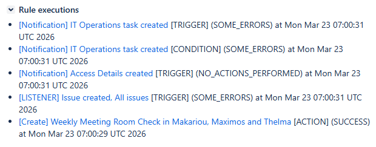

# Jira Automation Tracer

Tracks Automation for Jira execution logs and links them to affected issues via issue properties, displayed through a ScriptRunner web panel.

> **ATTENTION!** This uses non-documented Automation for Jira REST API endpoints.

## How It Works

1. A ScriptRunner scheduled job (`cronJob.groovy`) polls automation audit logs from Jira (paginated)
2. For each execution log, fetches the detailed item to extract affected issues
3. Groups entries by issue key with deduplication
4. Merges new entries with existing issue properties (without overwriting)
5. Tracks the last processed audit log ID in Plugin Settings to avoid reprocessing
6. On cold start (first run), saves the current latest audit log ID and begins processing from the next run

## Setup

### Prerequisites

- Jira Data Center with [Automation for Jira](https://marketplace.atlassian.com/apps/1215460/automation-for-jira-data-center-and-server)
- [ScriptRunner for Jira](https://marketplace.atlassian.com/apps/6820/scriptrunner-for-jira)

### Scheduled Job (`cronJob.groovy`)

1. In Jira, go to **ScriptRunner > Jobs**
2. Create a new **Custom Scheduled Job**
3. Paste the contents of `cronJob.groovy`
4. Configure the cron schedule (e.g., `0 0/5 * * * ?` for every 5 minutes)
5. Update the authentication header to use your own token/secrets provider

### Web Panel (`webPanel.groovy`)

1. Go to **ScriptRunner > Fragments > Web Panel**
2. Paste the contents of `webPanel.groovy`
3. Set the location to the desired issue view section (e.g., `atl.jira.view.issue.right.context`)

### Configuration

Key constants in `cronJob.groovy`:

| Constant | Default | Description |
| --- | --- | --- |
| `OFFSET_STEP` | `100` | Pagination step size |
| `DEFAULT_LIMIT` | `100` | Items per API request |
| `MAX_ITEMS_PER_RUN` | `1000` | Max items processed per execution |
| `PROPERTY_KEY` | `com.troshin.jira.automation.tracer` | Issue property key for storing trace data |

## Issue Property Format

Each affected issue gets a JSON property (`PROPERTY_KEY`) containing an array of automation log entries:

```json
[
    {
        "ruleId": 10,
        "ruleName": "test",
        "timestamp": 1768461846113,
        "component": "TRIGGER",
        "category": "SUCCESS"
    }
]
```

| Field       | Description                                                  |
| ----------- | ------------------------------------------------------------ |
| `ruleId`    | Automation rule ID                                           |
| `ruleName`  | Automation rule name                                         |
| `timestamp` | Execution timestamp (epoch ms)                               |
| `component` | Component type: `TRIGGER`, `BRANCH`, `ACTION`, etc.          |
| `category`  | Execution result: `SUCCESS`, `SOME_ERRORS`, `CONFIG_CHANGE`, etc. |

See full example in [audit-log-property.json](audit-log-property.json).

## Web Panel

The `webPanel.groovy` script renders automation trace data on the Jira issue view as a ScriptRunner web panel. It reads the issue property, deserializes it into `AutomationLogEntry` objects, and displays them as a table with component icons, status lozenges, and links to the automation rule audit log. Timestamps are displayed in the current user's timezone.



## API Endpoints (Non-Documented)

### Get Audit Log Items

```
GET /rest/cb-automation/latest/audit/GLOBAL?limit={limit}&offset={offset}
```

See example response in [audit-log-items.json](audit-log-items.json).

### Get Audit Log Item

```
GET /rest/cb-automation/latest/audit/GLOBAL/item/{ID}
```

See example response in [audit-log-item.json](audit-log-item.json).

### Get Issue Property

```
GET /rest/api/2/issue/{issueIdOrKey}/properties/{propertyKey}
```

### Set Issue Property

```
PUT /rest/api/2/issue/{issueIdOrKey}/properties/{propertyKey}
```

### Delete Issue Property

```
DELETE /rest/api/2/issue/{issueIdOrKey}/properties/{propertyKey}
```
